# paxos 算法

一篇 paxos 入门教程，从基本的分布式中的**复制**的问题出发，通过逐步解决和完善几个相关问题，最后推导出paxos的算法。

## 1、分布式系统要解决的问题

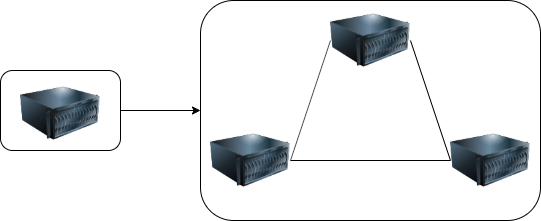

把一堆运行的机器协同起来，让多个机器成为一个整体系统。在这个系统中，每个机器都必须让系统中的状态达成一致。例如三副本集群如果一个机器上上传了一张图片，那么另外 2 台机器上也必须复制这张图片过来，整个系统才处于一个一致的状态。

分布式系统的一致性问题最终都归结为**分布式存储**的一致性。

几乎所有的分布式存储都必须用某种冗余的方式在廉价硬件的基础上搭建高可靠的存储。而冗余的基础就是**多副本策略**，一份数据存多份。多副本保证了可靠性，而副本之间的一致，就需要 paxos 这类分布式一致性算法来保证。

paxos是什么？

- 在分布式系统中保证多副本数据**强一致**的算法。

## 2、主从异步复制

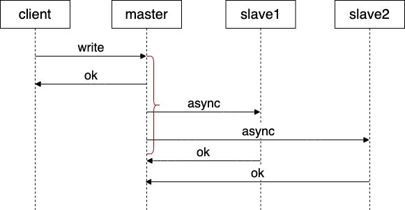

问题：

1. 数据复制到 slave 节点之前，如果 master 节点宕机，有可能造成数据丢失。不满足可靠性。

## 3、主从同步复制

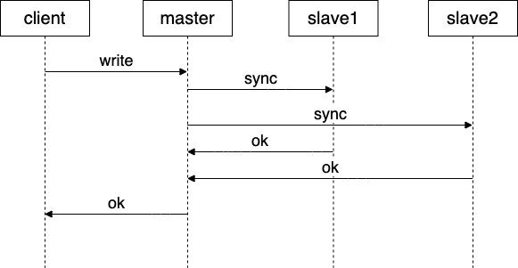

问题：

1. master，slave1，slave2 三个节点有任何一个节点宕机，整个系统就都不可用。不满足可用性。

## 4、主从半同步复制

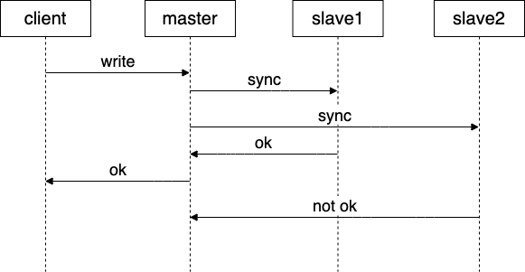

既保证了可靠性，也保证了可用性。

问题：

1. 各节点数据不一致，导致选主困难。

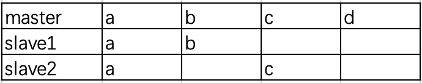

2. 当 slave 节点数据可读时，更新数据之后，连续两次读取数据可能不一致。

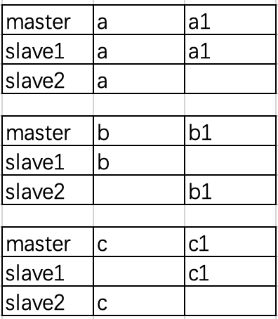

3. 并发写

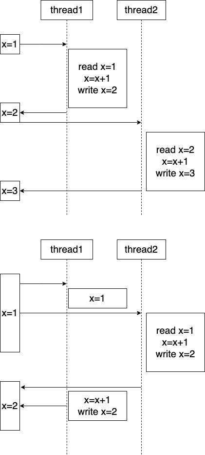

4. 并发读写

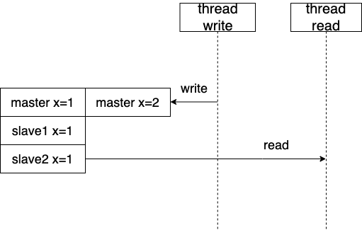

5. 删除

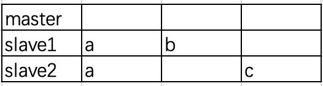

6. 节点连续宕机，选主，写入

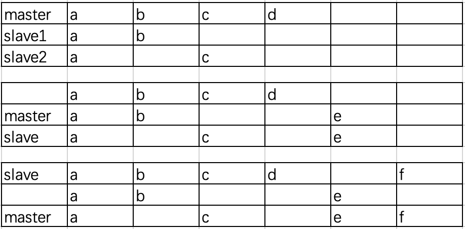

## 5、多数派读写

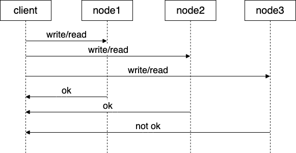

多数派写：client 向多个节点（大多数节点或者全部节点）发送写请求，只有大多数节点写入成功，该写请求才算成功。

多数派读：client 向多个节点（大多数节点或者全部节点）发送读请求，只有大多数节点返回数据，并且返回的数据一致，该读请求才算成功。

问题：
1. 多数派写完之后可能无法进行多数派读

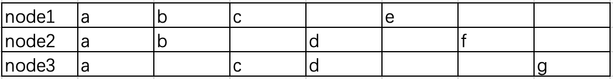

2. 更新数据之后，连续两次读取数据可能不一致。

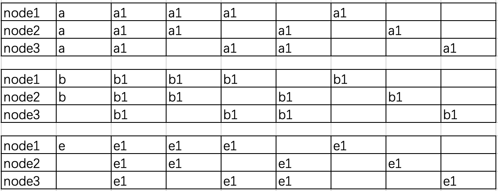

3. 并发写

4. 并发读写

5. 删除

## 6、poxos

多数派读写 + 写前读取

1. 写入和更新之前先多数派读
2. 修复数据
3. 写入和更新数据（多数派写）

数据写入和读取过程

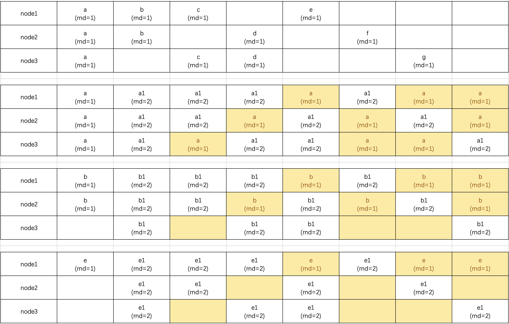

并发写

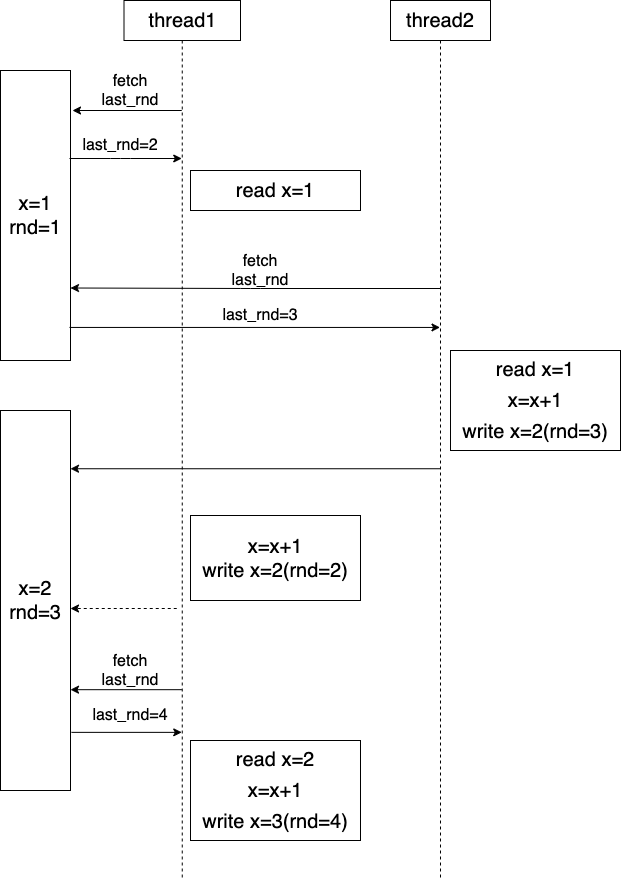

